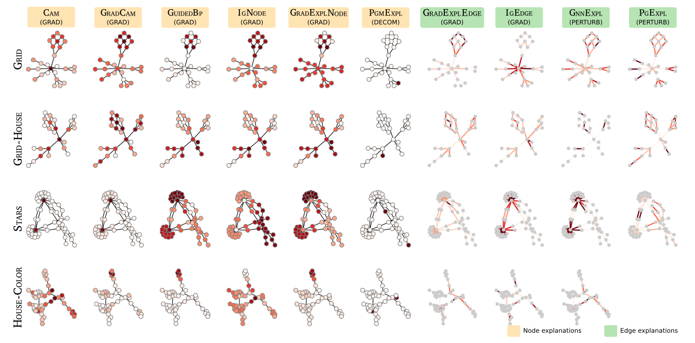

# Explaining-the-Explainers-in-Graph-Neural-Networks
Repository associated to the paper: ["Explaining the Explainers in Graph Neural Networks: a Comparative Study"](https://arxiv.org/pdf/2210.15304.pdf)



### Notebooks
1. **[GC] Load trained model**: it is a notebook to load and explore the trained model
2. **[GC] Evaluating explanations**: shows how to compute filter, plausibility and fidelity

### Datasets
In the folder dataset, you can find the networks used in this study!  
Into the folder Dataset you can find a readme explaining how to generate and explore the datasets

### Explanations
It contains the explanations produced by different explainers on different GNNs and datasets. Have a look at the README inside the folder for more info

### Models
It contains all the trained model used in our work! It also contains the classes to load the trained model. The notebook **[GC] Load trained model** show how to load and evaluate a trained model in graph classification.


### Experiments and code 
Work in progress!


### Citation

```
@article{longa2022explaining,
  title={Explaining the Explainers in Graph Neural Networks: a Comparative Study},
  author={Longa, Antonio and Azzolin, Steve and Santin, Gabriele and Cencetti, Giulia and Li{\`o}, Pietro and Lepri, Bruno and Passerini, Andrea},
  journal={arXiv preprint arXiv:2210.15304},
  year={2022}
}
```
